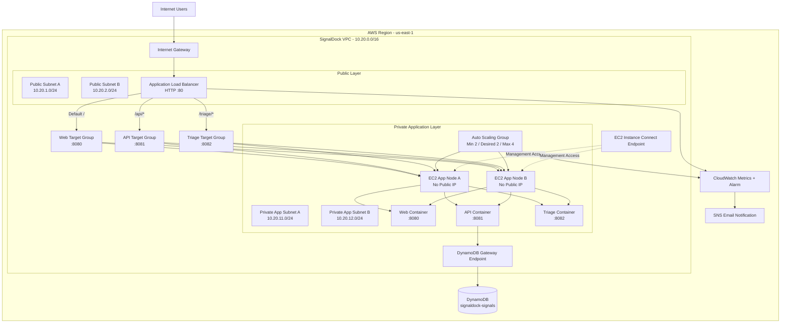

# SignalDock

**SignalDock** is a containerized security indicator intake and triage platform deployed on AWS.

The project was built as a practical cloud portfolio project to demonstrate AWS networking, private compute, Dockerized application deployment, Layer 7 load balancing, auto scaling, private AWS service access, IAM-based authorization, monitoring, alerting, and failure recovery.

> The goal of this project was not to build a production SIEM or threat intelligence platform.  
> It was designed to demonstrate real AWS architecture decisions around a small multi-service application.

---

## Project Overview

SignalDock provides two user-facing interfaces and one backend API:

- **Web Service** — allows users to submit suspicious indicators.
- **API Service** — handles application logic and stores data.
- **Triage Service** — allows analysts to review and update submitted indicators.

Supported indicator types can include:

- Domains
- IP addresses
- URLs
- File hashes

Each indicator contains metadata such as:

- Severity
- Status
- Creation time
- Indicator type

The application is split into three independent Dockerized services.

---

## Architecture



---

## Request Routing

SignalDock uses **Application Load Balancer path-based routing**.

| Request Path | Target Group | Backend Port | Service |
|---|---|---:|---|
| `/` | `signaldock-web-tg` | `8080` | Web Service |
| `/api/*` | `signaldock-api-tg` | `8081` | API Service |
| `/triage/*` | `signaldock-triage-tg` | `8082` | Triage Service |

The ALB listener receives HTTP traffic on port `80` and evaluates listener rules before forwarding the request to the correct target group.

The ALB does **not** rewrite the application path. For example:

```text
GET /api/signals
        |
        v
ALB listener rule
        |
        v
signaldock-api-tg
        |
        v
EC2:8081/api/signals
```

---

## AWS Services Used

| Service | Purpose |
|---|---|
| Amazon VPC | Isolated network for the project |
| Public / Private Subnets | Separation between public entry points and private application nodes |
| Internet Gateway | Internet connectivity for the public layer |
| Route Tables | Control network traffic paths |
| Security Groups | Stateful traffic filtering and SG-to-SG access control |
| Amazon EC2 | Docker application hosts |
| EC2 AMI | Golden image containing the prepared application environment |
| Launch Template | Defines how application EC2 instances are created |
| Auto Scaling Group | Maintains capacity, self-healing, and dynamic scaling |
| Application Load Balancer | Layer 7 routing and health-aware traffic distribution |
| Target Groups | Route requests to the correct container port |
| DynamoDB | Persistent application data store |
| DynamoDB Gateway VPC Endpoint | Private DynamoDB access without a NAT Gateway |
| IAM Role | Temporary AWS credentials for EC2 application nodes |
| EC2 Instance Connect Endpoint | Administrative access to private EC2 instances |
| CloudWatch | Metrics, health monitoring, and alarms |
| Amazon SNS | Email notifications for alarms |

---

## Network Design

### VPC

```text
VPC: signaldock-vpc
CIDR: 10.20.0.0/16
Region: us-east-1
```

### Subnets

| Name | CIDR | Role |
|---|---|---|
| `signaldock-public-a` | `10.20.1.0/24` | Public ALB subnet |
| `signaldock-public-b` | `10.20.2.0/24` | Public ALB subnet |
| `signaldock-app-a` | `10.20.11.0/24` | Private application subnet |
| `signaldock-app-b` | `10.20.12.0/24` | Private application subnet |

### Public Route Table

```text
10.20.0.0/16  -> local
0.0.0.0/0     -> Internet Gateway
```

### Private Application Route Table

```text
10.20.0.0/16  -> local
DynamoDB prefix list -> DynamoDB Gateway Endpoint
```

The private application subnets intentionally do not require a persistent NAT Gateway.

---

## Docker Design

The application is split into three services.

```text
services/
├── web/
│   ├── Dockerfile
│   ├── server.js
│   └── public/
│
├── api/
│   ├── Dockerfile
│   └── server.js
│
└── triage/
    ├── Dockerfile
    ├── server.js
    └── public/
```

Container ports:

```text
Web      -> 8080
API      -> 8081
Triage   -> 8082
```

All three containers run on each application EC2 node.

This allows the same EC2 instance to be registered in multiple target groups using different ports.

---

## Data Persistence

During local development, the API can use in-memory storage.

```text
STORAGE_MODE=memory
```

In AWS, the API uses DynamoDB:

```text
STORAGE_MODE=dynamodb
DYNAMODB_TABLE=signaldock-signals
AWS_REGION=us-east-1
```

Application nodes remain stateless.

```text
EC2-A ----\
           \
            -> DynamoDB
           /
EC2-B ----/
```

This ensures that replacing an EC2 instance does not remove application data.

---

## IAM Design

The application EC2 instances use:

```text
signaldock-ec2-role
```

The application does not store long-lived AWS access keys.

The API receives temporary credentials through the EC2 IAM role and IMDSv2.

Required DynamoDB permissions were limited to application operations such as:

```text
dynamodb:GetItem
dynamodb:Scan
dynamodb:PutItem
dynamodb:UpdateItem
```

The IAM policy was scoped to the SignalDock DynamoDB table.

---

## Security Design

### Application Load Balancer Security Group

Inbound:

```text
HTTP :80 <- Internet
```

### Application Security Group

Inbound:

```text
8080 <- signaldock-alb-sg
8081 <- signaldock-alb-sg
8082 <- signaldock-alb-sg

22   <- signaldock-eice-sg
```

Application EC2 instances:

- Run in private subnets.
- Do not require public IPv4 addresses.
- Do not expose application ports directly to the internet.
- Do not expose SSH to `0.0.0.0/0`.
- Use IAM roles instead of static access keys.

---

## Private Management Access

Private application instances are managed through an **EC2 Instance Connect Endpoint**.

```text
AWS Console
     |
     v
EC2 Instance Connect Endpoint
     |
     v
Private EC2
```

This avoids:

- Public SSH access
- Public IPv4 addresses on application nodes
- A permanent bastion host

---

## High Availability

The final application uses two Availability Zones.

```text
AZ-A                        AZ-B

Private EC2-A               Private EC2-B
      \                        /
       \                      /
        Application Load Balancer
```

The Auto Scaling Group maintains:

```text
Minimum: 2
Desired: 2
Maximum: 4
```

This keeps at least two application nodes available during normal operation.

---

## Auto Scaling

Two types of scaling behavior were tested.

### Self-Healing

When an application node becomes unhealthy:

```text
Target fails health check
        |
        v
Auto Scaling Group
        |
        v
Replace unhealthy EC2
        |
        v
Register replacement with target groups
```

### Dynamic Scaling

A target tracking policy was tested using average EC2 CPU utilization.

```text
CPU increases
     |
     v
Target Tracking Policy
     |
     v
Scale Out
```

When CPU utilization falls:

```text
CPU decreases
     |
     v
Scale In
```

During testing, the group successfully scaled from two instances to additional instances and later returned to its baseline capacity.

---

## Health Checks

Each service has its own health endpoint.

| Service | Health Check |
|---|---|
| Web | `/health` |
| API | `/api/health` |
| Triage | `/triage/health` |

This allows the ALB to independently validate each application component.

---

## Monitoring

The project intentionally uses lightweight AWS-native monitoring without deploying a CloudWatch Agent.

Observed metrics include:

### EC2

```text
CPUUtilization
```

### ALB / Target Groups

```text
RequestCount
TargetResponseTime
HTTPCode_Target_5XX_Count
HealthyHostCount
UnHealthyHostCount
```

---

## Alerting

A CloudWatch alarm monitors unhealthy targets.

```text
Target Group
     |
     v
UnHealthyHostCount
     |
     v
CloudWatch Alarm
     |
     v
SNS Topic
     |
     v
Email Notification
```

The SNS subscription was validated by publishing a test notification and by triggering the CloudWatch alarm during failure testing.

---

## Failure Testing

The project was tested using controlled failure scenarios.

### Container Failure

A web container was manually stopped.

Expected behavior:

```text
Web container stops
       |
       v
Target health check fails
       |
       v
Target becomes unhealthy
       |
       v
ALB routes traffic to healthy target
```

### EC2 Failure

An application EC2 instance was terminated.

Expected behavior:

```text
Desired capacity = 2
Actual capacity  = 1
        |
        v
Auto Scaling launches replacement
        |
        v
Replacement becomes healthy
```

### Persistence Test

Indicators stored before EC2 replacement remained available because application state was stored in DynamoDB.

---

## Troubleshooting Approach

The project was intentionally troubleshot layer by layer rather than rebuilding resources.

Typical sequence:

```text
1. Check target health.
2. Check Security Group rules.
3. Check container status.
4. Check container port mapping.
5. Check application health endpoint.
6. Check IAM permissions.
7. Check DynamoDB table name and region.
8. Check VPC endpoint / route table.
9. Check Auto Scaling activity.
10. Check CloudWatch metrics.
```

Useful commands:

```bash
docker ps

docker logs signaldock-web
docker logs signaldock-api
docker logs signaldock-triage

curl http://localhost:8080/health
curl http://localhost:8081/api/health
curl http://localhost:8082/triage/health
```

---

## Key Problems Solved During Implementation

### DynamoDB ResourceNotFoundException

The API initially returned:

```text
ResourceNotFoundException: Requested resource not found
```

The application was configured to use:

```text
signaldock-signals
```

while the original DynamoDB table had been created with the wrong name.

The table and IAM policy were corrected so the application, IAM resource ARN, and DynamoDB table name matched.

### Docker and IAM Credentials

The API container required AWS credentials without embedding access keys.

The solution used:

```text
EC2 IAM Role
     |
     v
IMDSv2
     |
     v
AWS SDK
```

The instance metadata response hop limit was configured to support credential access from the containerized application.

### CloudWatch Alarm Testing

The alert path was validated separately from the Auto Scaling self-healing process to ensure the metric, alarm state transition, SNS topic, and email subscription were all working correctly.

---

## Cost-Aware Architecture Decisions

The project was intentionally designed to avoid unnecessary persistent cost.

Key decisions:

- No permanent NAT Gateway.
- Private DynamoDB access through a Gateway VPC Endpoint.
- Small EC2 instance types for testing.
- Temporary builder EC2 instance.
- Builder removed after AMI creation.
- CloudWatch Agent and application log forwarding were not required.
- NLB was not added because there was no business requirement for Layer 4 routing or static public entry IPs.
- Resources were deleted after testing and documentation.

---

## Repository Structure

```text
signaldock/
│
├── services/
│   ├── web/
│   │   ├── public/
│   │   ├── Dockerfile
│   │   ├── package.json
│   │   └── server.js
│   │
│   ├── api/
│   │   ├── Dockerfile
│   │   ├── package.json
│   │   └── server.js
│   │
│   └── triage/
│       ├── public/
│       ├── Dockerfile
│       ├── package.json
│       └── server.js
│
├── docs/
│   ├── architecture.md
│   ├── testing.md
│   ├── troubleshooting.md
│   ├── cleanup.md
│   └── screenshots/
│
├── docker-compose.yml
├── .gitignore
└── README.md
```

---

## Deployment Lifecycle

The project was implemented in phases:

```text
Local Application
        |
        v
Git / GitHub
        |
        v
Dockerization
        |
        v
VPC Network
        |
        v
DynamoDB + IAM + VPC Endpoint
        |
        v
Temporary Builder EC2
        |
        v
Golden AMI
        |
        v
ALB + Target Groups
        |
        v
Launch Template
        |
        v
Auto Scaling Group
        |
        v
Private Management
        |
        v
Failure Testing
        |
        v
Monitoring + Alerting
```

---

## What I Learned

This project reinforced the difference between simply deploying EC2 instances and designing an application architecture.

Key lessons included:

- A public subnet is defined by routing, not by its name.
- Private EC2 instances do not require public IPs to receive traffic from an ALB.
- Security Group referencing is preferable to exposing application ports broadly.
- ALB listener rules can route different URL paths to different application services.
- One EC2 instance can participate in multiple target groups using different ports.
- Application state should not live only inside containers when using Auto Scaling.
- IAM authorization and network connectivity are separate concerns.
- VPC endpoints can remove the need for a NAT Gateway for supported AWS services.
- Auto Scaling provides both capacity management and self-healing.
- Monitoring and alerting are different concepts.
- Failure testing is necessary to validate an architecture rather than assuming it is resilient.

---

## Project Status

**Completed**

The AWS infrastructure was deployed, tested, monitored, failure-tested, documented, and then removed to avoid unnecessary ongoing cloud cost.

The source code and documentation remain available in this repository as a portfolio project.

---

## Future Improvements

Potential future improvements include:

- HTTPS with ACM and a custom domain.
- Authentication and authorization for the triage console.
- Centralized application logging.
- Infrastructure as Code using Terraform.
- Container image storage using Amazon ECR.
- ECS or ECS Fargate deployment.
- CI/CD deployment workflow.
- WAF integration.
- More advanced DynamoDB access patterns.

These were intentionally kept outside the core project to avoid unnecessary complexity and cost.
